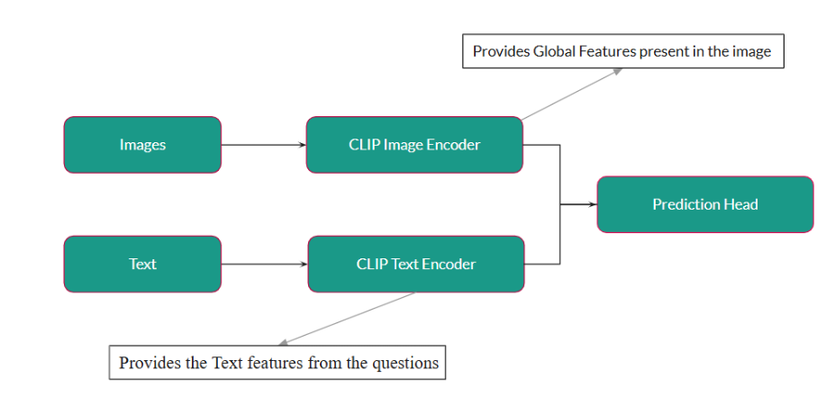
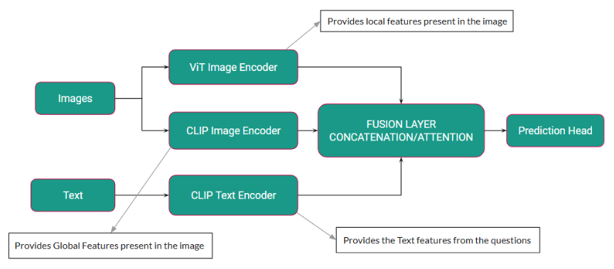
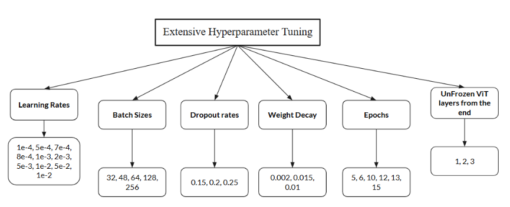
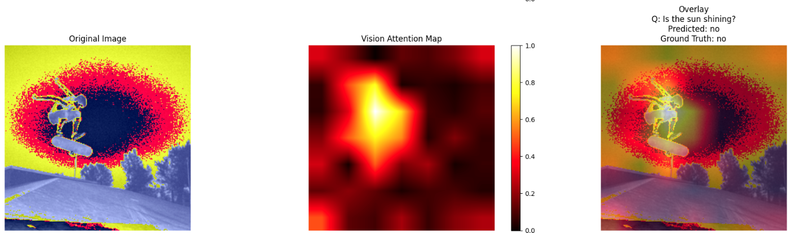
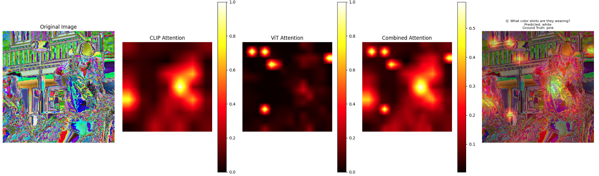
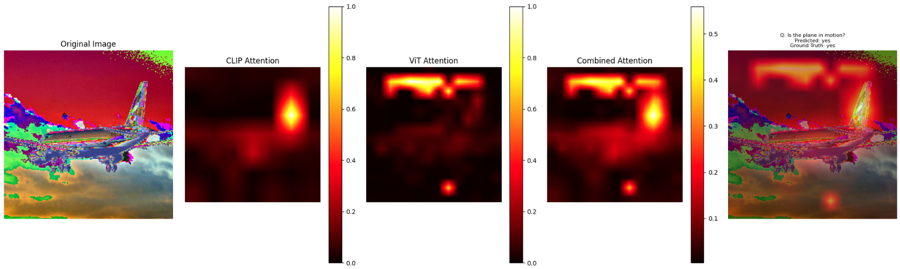

# Visual Question Answering (VQA) Using CLIP with Local Feature Enhancement

Visual Question Answering (VQA) requires a model to understand the overall
context as well as the fine-grained details of an image. The CLIP model by
OpenAI is effective at extracting global features from an image but struggles
with tasks that require a detailed understanding of local features. To address
this, we propose a dual encoder architecture that combines CLIP’s global
features with local features extracted using a Vision Transformer (ViT). These
features are fused through either concatenation or attention-based layers to
enhance the model’s ability to answer complex questions. Our approach tries to
improve the model’s output metrics and capability to recognize fine-grained
details, making it more effective for VQA tasks.

## **Methodology**

This project addresses the limitations of CLIP in handling Visual Question
Answering (VQA) tasks by introducing a dual encoder architecture that integrates
global and local feature extraction for enhanced reasoning capabilities.

1. **Baseline CLIP Implementation**

   - The baseline model leverages CLIP’s pre-trained capabilities for global
     feature extraction.
   - **Image Encoder**: Processes images to extract a 768-dimensional embedding.
   - **Text Encoder**: Embeds questions into the same shared space as the image
     embeddings.
   - Features are concatenated and passed to a prediction head, which uses batch
     normalization, dropout, and GELU activation for stability and performance.

    _Baseline CLIP
   Architecture_

2. **Dual Encoder Architecture**

   - Introduces a second Vision Transformer (ViT-B/16) to capture fine-grained
     local features.
   - **Fusion Mechanisms**:
     - **Concatenation-Based Fusion**: Aligns global, local, and text features
       into a unified space, preserving their individual characteristics.
     - **Attention-Based Fusion**: Dynamically assigns importance to feature
       streams using multi-head attention.
   - The architecture integrates these features into a prediction head for
     answer classification.

    _Dual Encoder
   Architecture_

3. **Training Framework**

   - **Optimizer**: AdamW with weight decay for generalization.
   - **Loss Function**: Cross-entropy loss.
   - **Regularization**: Dropout in fusion layers and prediction head to combat
     overfitting.
   - **Techniques**:
     - Batch normalization for stability.
     - Mixed precision training for memory efficiency and faster computation.

    _Hyperparameter Tuning Overview_

---

## **Results**

The performance of the models was evaluated using BLEU-1, METEOR scores, and
accuracy across different question types.

1. **Performance Metrics**

   | **Model**                    | **BLEU-1** | **METEOR** |
   | ---------------------------- | ---------- | ---------- |
   | Baseline CLIP                | 0.4672     | 0.2382     |
   | Dual Encoder + Concatenation | 0.4634     | 0.2372     |
   | Dual Encoder + Attention     | 0.4326     | 0.2214     |

   _Performance Metrics for BLEU-1 and METEOR_

2. **Accuracy Across Models**

   | **Model**                    | **Training Accuracy** | **Validation Accuracy** | **Test Accuracy** |
   | ---------------------------- | --------------------- | ----------------------- | ----------------- |
   | Baseline CLIP                | 50.59%                | 47.03%                  | 46.45%            |
   | Dual Encoder + Concatenation | 55.79%                | 45.25%                  | 46.07%            |
   | Dual Encoder + Attention     | 49.71%                | 42.52%                  | 42.96%            |

   _Training, Validation, and Test Accuracies for Each Model_

3. **Performance by Question Type**

   | **Model**                    | **Yes/No Accuracy** | **Color Accuracy** | **Count Accuracy** |
   | ---------------------------- | ------------------- | ------------------ | ------------------ |
   | Baseline CLIP                | 53.83%              | 47.11%             | 37.87%             |
   | Dual Encoder + Concatenation | 51.60%              | 44.89%             | 37.16%             |
   | Dual Encoder + Attention     | 50.63%              | 40.71%             | 33.51%             |

   _Per-Question Type Accuracies for Each Model_

4. **Visual Analysis**

    
   _CLIP Model Heatmaps_

   
   _Dual Encoder with Concatenation Heatmaps_

   
   _Dual Encoder with Attention Heatmaps_

## Extra

Read the detailed report [here](Report.pdf)

